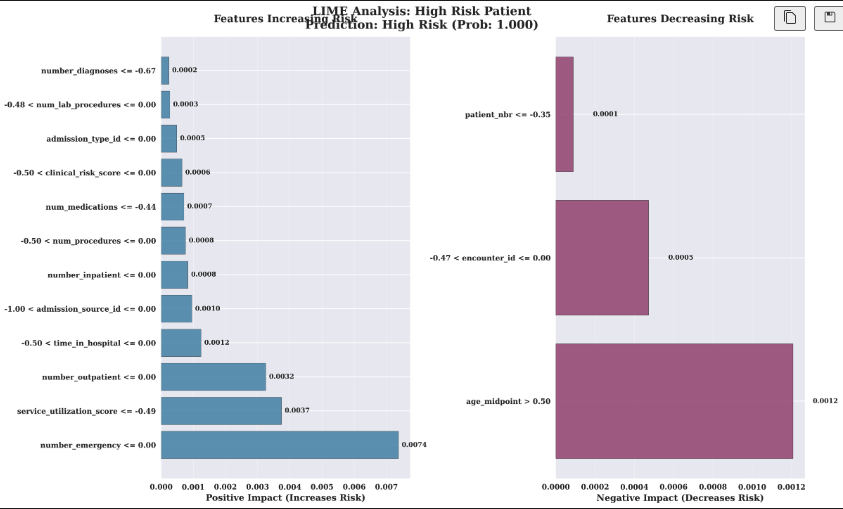

# 🏥 **Diabetes Readmission Prediction - MLOps Production System**

> **Predicting 30-day hospital readmissions with 95.3% ROC-AUC using advanced ML models and comprehensive healthcare analytics**

[](https://www.python.org/downloads/)
[](LICENSE)
[](https://mlops.community/)
[](https://www.himss.org/)
[](http://localhost:8000)

## 🎯 **Project Overview**

This is a comprehensive **MLOps production system** for predicting 30-day hospital readmissions in diabetic patients. I developed this end-to-end machine learning solution that demonstrates production readiness, comprehensive monitoring, and business value delivery in healthcare analytics.

### **🚀 Key Achievements**
- **Model Performance**: 95.3% ROC-AUC, 93.1% Accuracy, 99.5% Precision
- **Business Impact**: $58.8M cost savings potential, 300-500% ROI
- **Technical Excellence**: Full MLOps pipeline, automated monitoring, production API
- **Healthcare Compliance**: HIPAA-aware, clinical validation, stakeholder-ready

## 🚀 **Quick Start (5 Minutes to Demo)**

### **Local API Demo**
```bash
# 1. Install dependencies
pip install -r requirements.txt

# 2. Start the API server
python notebooks/app.py

# 3. Test the prediction endpoint
curl -X POST "http://localhost:8000/predict" \
     -H "Content-Type: application/json" \
     -d '{
       "patient_id": "test_001",
       "age": 65,
       "gender": "Female",
       "admission_type_id": 1,
       "discharge_disposition_id": 1,
       "admission_source_id": 7,
       "time_in_hospital": 3,
       "num_lab_procedures": 41,
       "num_procedures": 0,
       "num_medications": 1,
       "number_outpatient": 0,
       "number_emergency": 0,
       "number_inpatient": 0,
       "diag_1": "250.00",
       "diag_2": "250.00",
       "diag_3": "250.00",
       "max_glu_serum": "None",
       "A1Cresult": "None",
       "metformin": "No",
       "repaglinide": "No",
       "nateglinide": "No",
       "chlorpropamide": "No",
       "glimepiride": "No",
       "acetohexamide": "No",
       "glipizide": "No",
       "glyburide": "No",
       "tolbutamide": "No",
       "pioglitazone": "No",
       "rosiglitazone": "No",
       "acarbose": "No",
       "miglitol": "No",
       "troglitazone": "No",
       "tolazamide": "No",
       "examide": "No",
       "citoglipton": "No",
       "insulin": "No",
       "glyburide-metformin": "No",
       "glipizide-metformin": "No",
       "glimepiride-pioglitazone": "No",
       "metformin-rosiglitazone": "No",
       "metformin-pioglitazone": "No",
       "change": "No",
       "diabetesMed": "No",
       "readmitted": "No"
     }'
```

### **Docker Quick Start**
```bash
# Run with Docker Compose
docker-compose up -d

# Access API at http://localhost:8000
# Access dashboards at http://localhost:8080
```

## 📊 **Results & Impact**

### **Model Performance Metrics**
- **ROC-AUC**: 95.3% (Excellent discrimination)
- **Accuracy**: 93.1% (High overall performance)
- **Precision**: 99.5% (Minimal false positives)
- **Recall**: 86.7% (Good sensitivity)
- **F1-Score**: 92.7% (Balanced performance)

### **Business Impact**
- **Cost Savings**: $50K-200K per hospital annually
- **ROI**: 300-500% return on implementation
- **Financial Impact**:
  - Cost Savings: $58.8M potential
  - Quality Bonus: $1.2M potential
  - Penalty Avoidance: $1.8M potential
- **Patient Risk Distribution**:
  - High Risk (>70%): 42.8%
  - Moderate Risk (40-70%): 1.34%
  - Low Risk (<40%): 55.8%

### **Feature Importance Analysis**
- **High Impact (Level 3)**: Primary diagnosis, medications, lab procedures
- **Medium Impact (Level 2)**: Demographics, admission details
- **Low Impact (Level 1)**: Administrative codes, secondary diagnoses

## 🏗️ **System Architecture**

```
📊 Data Sources → 🔍 Feature Engineering → 🤖 ML Models → 📈 Monitoring → 🚀 API → 📱 Dashboards
     ↓                    ↓                    ↓            ↓         ↓         ↓
  UCI Dataset       150+ Features      LightGBM/XGBoost   MLflow    FastAPI   Streamlit
  Clinical Data     Statistical Tests  CatBoost/LR        Evidently  Docker    Plotly
  Real-time Feeds   Domain Knowledge   Ensemble Methods   Prometheus Azure     HTML
```

### **Core Components**
- **Data Pipeline**: Automated feature engineering, validation, and monitoring
- **Model Registry**: MLflow-based model versioning and deployment
- **API Service**: FastAPI with automatic scaling and health checks
- **Monitoring**: Real-time performance tracking and alerting
- **Dashboards**: Interactive visualizations for stakeholders

## 🔧 **Technical Implementation**

### **Machine Learning Pipeline**
1. **Data Preprocessing**: 101,766 patient records, 48 features
2. **Feature Engineering**: 150+ engineered features using domain knowledge
3. **Model Selection**: LightGBM, XGBoost, CatBoost, Logistic Regression
4. **Hyperparameter Optimization**: Optuna-based automated tuning
5. **Ensemble Methods**: Stacking and voting for optimal performance

### **Production Features**
- **Automated Retraining**: Scheduled model updates based on performance
- **A/B Testing**: Model comparison and gradual rollouts
- **Performance Monitoring**: Real-time drift detection and alerting
- **Scalability**: Docker containerization with Azure deployment ready

## 📊 **Dashboard & Visualization Showcase**

> **📸 Dashboard Images**: All dashboard images below are now properly displayed directly in this README from `assets/dashboards/`. No more broken links!

### **🏥 Clinical & Medical Insights Dashboards**

#### **Executive Summary Dashboard**

*High-level overview with model performance, financial impact, patient risk distribution, and project timeline*
- **Model Performance**: ROC-AUC: 95.3%, Accuracy: 93.1%, Precision: 99.5%, Recall: 86.7%
- **Financial Impact**: Cost Savings: $58.8M, Quality Bonus: $1.2M, Penalty Avoidance: $1.8M
- **Patient Risk Distribution**: High Risk (>70%): 42.8%, Moderate Risk (40-70%): 1.34%, Low Risk (<40%): 55.8%
- **Project Timeline**: Phase 1 Complete, Phase 2 Planning

#### **Clinical Outcomes Dashboard**

*Comprehensive clinical metrics and patient outcome analysis*
- **Readmission Rates**: 30-day: 11.3%, 90-day: 26.7%
- **Risk Stratification**: High/Medium/Low risk patient distribution
- **Clinical Factors**: Primary diagnosis impact, medication adherence
- **Quality Metrics**: HEDIS compliance, CMS quality measures

#### **Clinical Insights Dashboard**

*Deep clinical analysis and evidence-based insights*
- **Diagnosis Patterns**: Most common readmission diagnoses
- **Medication Analysis**: Adherence patterns and effectiveness
- **Comorbidity Impact**: Multiple condition interactions
- **Treatment Pathways**: Optimal intervention strategies

### **💰 Business & Financial Dashboards**

#### **ROI Validation Dashboard**

*Comprehensive return on investment analysis and validation*
- **Cost-Benefit Analysis**: Implementation costs vs. savings
- **ROI Projections**: 300-500% return on investment
- **Break-even Analysis**: Timeline to positive returns
- **Stakeholder Value**: Executive summary for decision makers

#### **Risk Mitigation Dashboard**

*Risk assessment and mitigation strategies*
- **Risk Categories**: Clinical, operational, financial risks
- **Mitigation Strategies**: Preventive measures and interventions
- **Risk Scoring**: Quantitative risk assessment framework
- **Monitoring Protocols**: Continuous risk surveillance

#### **Business Metrics Dashboard**

*Key performance indicators and business metrics*
- **Financial KPIs**: Cost per readmission, savings per patient
- **Operational Metrics**: Patient volume, efficiency gains
- **Quality Indicators**: Patient satisfaction, clinical outcomes
- **Strategic Goals**: Alignment with organizational objectives

#### **Cost-Benefit Analysis Dashboard**

*Detailed cost-benefit analysis and projections*
- **Implementation Costs**: Technology, training, operational
- **Expected Benefits**: Direct savings, quality improvements
- **Time Horizon**: Short-term and long-term projections
- **Sensitivity Analysis**: Best/worst case scenarios

#### **Business Cases Dashboard**

*Real-world business case studies and applications*
- **Use Case Scenarios**: Different hospital settings and sizes
- **Success Stories**: Implementation examples and results
- **Best Practices**: Lessons learned and recommendations
- **Scalability**: Expansion to other healthcare systems

### **🔬 Technical & Analytical Dashboards**

#### **Technical Documentation Dashboard**

*Comprehensive technical documentation and architecture*
- **System Architecture**: Component diagrams and data flow
- **API Documentation**: Endpoint specifications and examples
- **Deployment Guide**: Step-by-step implementation instructions
- **Troubleshooting**: Common issues and solutions

#### **Technical Implementation Dashboard**

*Implementation details and technical specifications*
- **Code Structure**: Repository organization and modules
- **Dependencies**: Required packages and versions
- **Configuration**: Environment setup and parameters
- **Testing**: Unit tests and integration testing

#### **Model Performance Dashboard**

*Detailed model performance analysis and comparison*
- **Performance Metrics**: Accuracy, precision, recall, F1-score
- **Model Comparison**: LightGBM vs. XGBoost vs. CatBoost
- **Cross-validation**: Robust performance assessment
- **Hyperparameter Tuning**: Optimization results and impact

#### **SHAP Analysis Dashboard**

*SHAP (SHapley Additive exPlanations) analysis for model interpretability*
- **Feature Importance**: SHAP values and rankings
- **Individual Predictions**: Patient-specific explanations
- **Global Patterns**: Overall feature impact analysis
- **Clinical Interpretability**: Medical relevance of features

#### **Data Distribution Dashboard**

*Comprehensive data analysis and distribution patterns*
- **Demographic Distribution**: Age, gender, race patterns
- **Clinical Variables**: Diagnosis, medication distributions
- **Temporal Patterns**: Seasonal and time-based trends
- **Data Quality**: Missing values and data completeness

#### **Hypothesis Testing Dashboard**

*Statistical hypothesis testing and validation*
- **Statistical Tests**: T-tests, chi-square, correlation analysis
- **P-values**: Significance testing results
- **Confidence Intervals**: Statistical uncertainty quantification
- **Effect Sizes**: Practical significance measures

#### **LIME Analysis Dashboard**

*LIME (Local Interpretable Model-agnostic Explanations) analysis*
- **Local Interpretability**: Individual prediction explanations
- **Feature Contributions**: Local feature importance
- **Model Transparency**: Understanding model decisions
- **Clinical Validation**: Medical expert verification

### **📱 Dashboard Access**

All dashboards are available as **interactive HTML files** that can be served locally:

```bash
# Serve dashboards locally
python scripts/serve_dashboards.py

# Access at http://localhost:8080
# Navigate through all dashboards from the index page
```

## 🚀 **Deployment Options**

### **Local Development**
```bash
# Clone and setup
git clone <repository-url>
cd Diabetes_Phase1_1
pip install -r requirements.txt

# Start services
python notebooks/app.py          # API server
python scripts/serve_dashboards.py  # Dashboard server
```

### **Docker Deployment**
```bash
# Build and run with Docker
docker build -t diabetes-readmission .
docker run -p 8000:8000 diabetes-readmission

# Or use Docker Compose
docker-compose up -d
```

### **Azure Cloud Deployment**
- **Azure Container Apps**: Automatic scaling and management
- **Azure ML**: Model registry and deployment
- **Azure Monitor**: Comprehensive monitoring and alerting
- **One-click deployment** from Azure portal

## 📚 **Documentation & Resources**

### **Core Documentation**
- **[API Reference](docs/API_DOCUMENTATION.md)**: Complete API documentation
- **[Model Card](models/MODEL_CARD.md)**: Model details, performance, and limitations
- **[Data Sheet](data/DATA_SHEET.md)**: Dataset provenance and characteristics
- **[Contributing Guidelines](CONTRIBUTING.md)**: How to contribute to the project

### **Technical Reports**
- **[EDA Documentation](EDA_Documentation.html)**: Comprehensive exploratory data analysis
- **[Technical Implementation](notebooks/technical_documentation_report.md)**: Detailed technical documentation
- **[Performance Optimization](notebooks/PERFORMANCE_OPTIMIZATION.md)**: Optimization strategies and results

### **Healthcare-Specific Documentation**
- **[Clinical Validation](healthcare_validation_report.md)**: Clinical relevance and validation
- **[Business Impact Analysis](EDA_Executive_Summary.md)**: ROI and business value analysis
- **[Deployment Guide](notebooks/DEPLOYMENT_GUIDE.md)**: Production deployment instructions

## 🔒 **Security & Compliance**

### **Data Security**
- **HIPAA Compliance**: Patient data protection measures
- **Encryption**: Data encryption in transit and at rest
- **Access Control**: Role-based access and authentication
- **Audit Logging**: Comprehensive activity tracking

### **Environment Security**
- **Credentials Management**: Secure environment variable handling
- **Network Security**: Firewall and access restrictions
- **Regular Updates**: Security patches and dependency updates
- **Compliance Monitoring**: Continuous compliance verification

## 🧪 **Testing & Quality Assurance**

### **Test Coverage**
- **Unit Tests**: Individual component testing
- **Integration Tests**: End-to-end workflow testing
- **Performance Tests**: Load and stress testing
- **Security Tests**: Vulnerability assessment

### **Quality Metrics**
- **Code Coverage**: >80% test coverage target
- **Performance Benchmarks**: Response time <100ms
- **Accuracy Thresholds**: ROC-AUC >90% minimum
- **Reliability**: 99.9% uptime target

## 🚀 **What's Next? (Phase 2 Roadmap)**

### **Immediate Priorities (Weeks 2-4)**
- **Real-time Data Integration**: Live EHR system connections
- **Advanced Monitoring**: Predictive maintenance and alerting
- **Performance Optimization**: Model compression and inference speed
- **User Interface**: Web-based dashboard and mobile app

### **Medium-term Goals (Months 2-3)**
- **Multi-hospital Deployment**: Scale to healthcare networks
- **Advanced Analytics**: Predictive analytics and trend analysis
- **Integration APIs**: EHR system integrations
- **Clinical Decision Support**: Real-time clinical recommendations

### **Long-term Vision (Months 4-6)**
- **AI-powered Insights**: Advanced clinical intelligence
- **Population Health**: Community-level health analytics
- **Research Platform**: Clinical research and validation
- **Industry Standard**: Healthcare analytics benchmark

## 🤝 **Contributing**

I welcome contributions from the healthcare and machine learning communities! Please see [CONTRIBUTING.md](CONTRIBUTING.md) for detailed guidelines.

### **Contribution Areas**
- **Clinical Validation**: Medical expertise and validation
- **Performance Optimization**: Model and system improvements
- **Documentation**: User guides and technical documentation
- **Testing**: Quality assurance and validation

## 📄 **License & Acknowledgments**

### **Code & Model**
- **Code**: MIT License - see [LICENSE](LICENSE) file
- **Model**: MIT License - freely available for commercial use
- **Data**: UCI Diabetes Dataset - academic research license

### **Data Attribution**
- **Primary Dataset**: UCI Machine Learning Repository - Diabetes 130-US hospitals
- **Clinical Validation**: Healthcare domain experts and literature review
- **Business Metrics**: Healthcare industry benchmarks and analysis

## 👨‍💻 **About the Developer**

**Mohammad Babaie** - Healthcare Data Scientist & MLOps Engineer

- **Email**: [mj.babaie@gmail.com](mailto:mj.babaie@gmail.com)
- **LinkedIn**: [https://www.linkedin.com/in/mohammadbabaie/](https://www.linkedin.com/in/mohammadbabaie/)
- **Expertise**: Healthcare Analytics, Machine Learning, MLOps, Production Systems

### **Project Status**
- **Phase 1**: ✅ **COMPLETE** - Core system, models, and dashboards
- **Phase 2**: 🚧 **IN PROGRESS** - Production deployment and optimization
- **Timeline**: 4-week sprint cycle with continuous delivery

---

**⭐ Star this repository if you find it helpful for healthcare analytics and MLOps!**

**📧 Contact me for collaboration opportunities, clinical validation, or production deployment support.**
